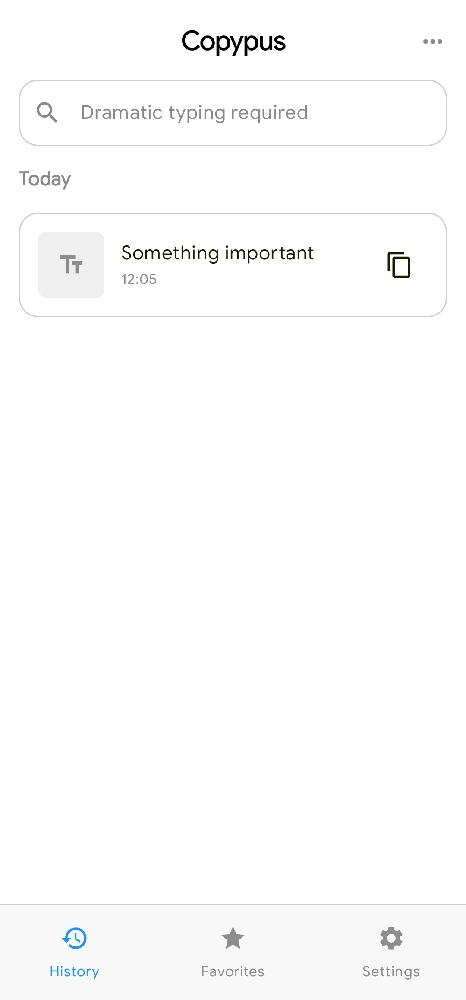
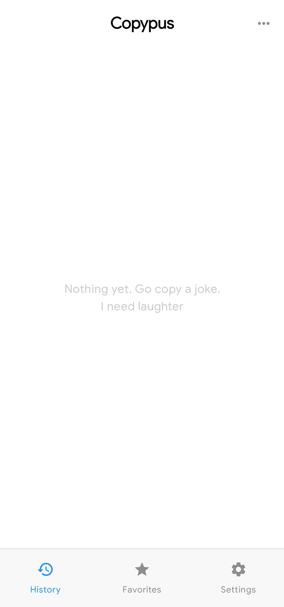
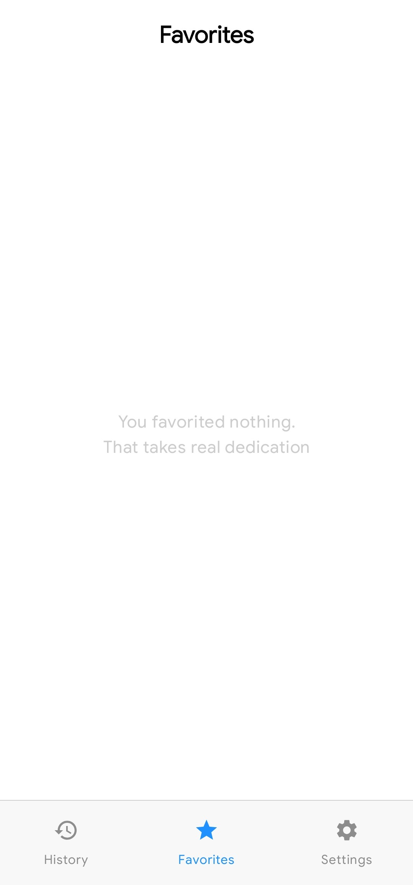
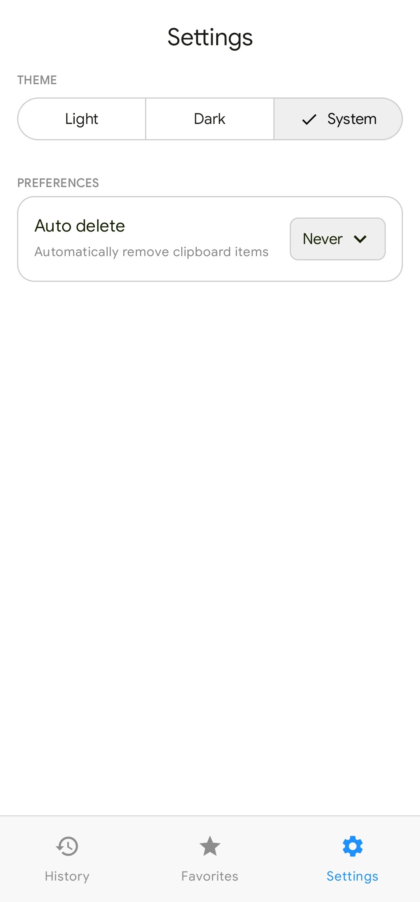

  

<h1 align="center">
  Copypus
</h1>

 

<b>Copypus automatically saves everything you copy – links, text snippets, code</b>

    
    <table>
    <tr>
    <td>
    
    </td>
    </tr>
    </table>
    
    

<h2 align="center">
✨<b>Features</b>
</h2>

- **Automatic Clipboard Saving** 
  - Anything copied in other apps is automatically detected and saved when you open the app.

- **Favorites Support**
  - Swipe right to add items to favorites and access them anytime in a dedicated Favorites tab.

- **Quick Delete Gestures**
  - Swipe left to instantly remove unnecessary clipboard items.

- **One-Tap Copying**
  - Easily copy saved content back to your clipboard with a dedicated copy button.

- **Smart Date Grouping**
  - Clipboard history is automatically organized by time sections like **Today**, **Yesterday**, and older dates.

- **Fast Search**
  - Quickly find copied text using the built-in search feature.

- **Clear All History**
  - Remove your entire clipboard history with a single tap.

- **Customizable App Theme**
  - Choose the app theme that fits your style in Settings.

- **Auto-Delete Options**
  - Automatically remove old clipboard items after:
    * 1 hour
    * 5 hours
    * 1 day
    * 1 week
    * 1 month
    * or never

- **Bottom Navigation**
  - Simple bottom navigation for quick access to:

    * Clipboard History
    * Favorites
    * Settings

